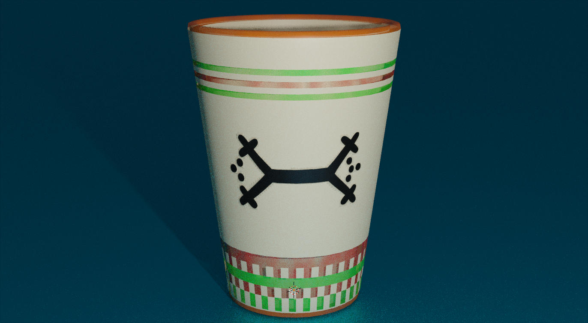

# Mod-le-de-Verre-Avec-Blender
# Modèle de Verre en 3D

Ce dépôt contient un modèle de verre en 3D créé avec Blender. Ce modèle peut être utilisé pour des projets de rendu, d'animation ou d'impression 3D.

## Caractéristiques

- Modèle de verre réaliste en 3D
- Créé avec Blender version 3.00
- Textures et matériaux de base inclus

## Fichiers inclus

- **UnVerre.blend** : Fichier Blender contenant le modèle du verre.
- **lezard-berbere-t-shirt-manches-longues-henley.jpg** : symbole berber 

## Utilisation

Pour utiliser ce modèle de verre en 3D :

1. Clonez ou téléchargez ce dépôt sur votre machine locale.
2. Ouvrez le fichier **verre.blend** avec Blender.
3. Explorez le modèle, ajustez-le selon vos besoins ou intégrez-le dans vos projets.

## Aperçu

## Licence

Ce modèle est disponible sous la licence [Creative Commons Attribution 4.0 International License](https://creativecommons.org/licenses/by/4.0/).

## Auteur

Ce modèle a été créé par [AIT Talla](https://aittalla-corporation.web.app).
